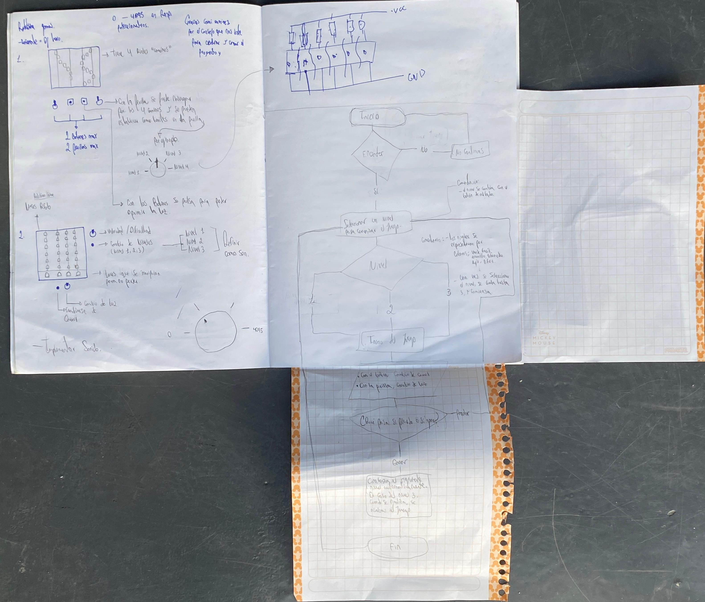
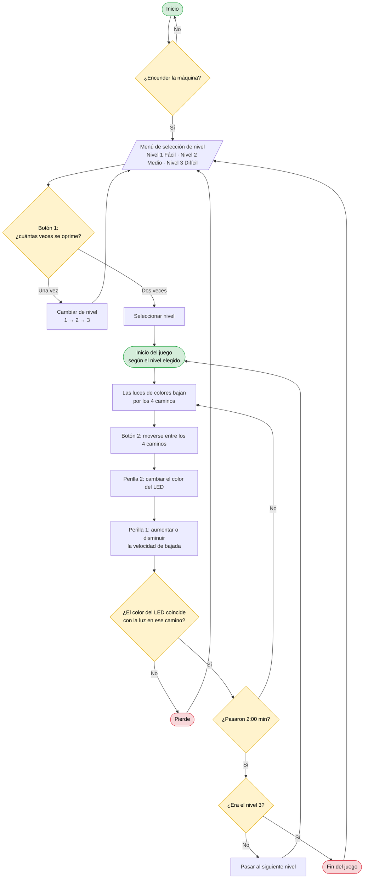

# Génesis del proyecto

# Diagrama de flujo, experiencia de usuario 

    

```mermaid
flowchart TD
    A([Inicio]) --> B{¿Encender la máquina?}
    B -- No --> A
    B -- Sí --> C[/Menú de selección de nivel<br/>Nivel 1 Fácil · Nivel 2 Medio · Nivel 3 Difícil/]

    C --> D{Botón 1:<br/>¿cuántas veces se oprime?}
    D -- "Una vez" --> E[Cambiar de nivel<br/>1 → 2 → 3]
    E --> C
    D -- "Dos veces" --> F[Seleccionar nivel]

    F --> G([Inicio del juego<br/>según el nivel elegido])
    G --> H[Las luces de colores bajan<br/>por los 4 caminos]

    H --> I[Botón 2: moverse entre los 4 caminos]
    I --> J[Perilla 2: cambiar el color del LED]
    J --> K[Perilla 1: aumentar o disminuir<br/>la velocidad de bajada]

    K --> L{¿El color del LED coincide<br/>con la luz en ese camino?}
    L -- No --> M([Pierde])
    M --> C

    L -- Sí --> N{¿Pasaron 2:00 min?}
    N -- No --> H
    N -- Sí --> O{¿Era el nivel 3?}
    O -- No --> P[Pasar al siguiente nivel]
    P --> G
    O -- Sí --> Q([Fin del juego])
    Q --> C

    classDef inicio fill:#d4edda,stroke:#28a745,color:#000;
    classDef decision fill:#fff3cd,stroke:#e0a800,color:#000;
    classDef fin fill:#f8d7da,stroke:#dc3545,color:#000;
    class A,G inicio;
    class B,D,L,N,O decision;
    class M,Q fin;
```

# Diagrama de flujo, botones 
# Diagrama de flujo, perillas 
